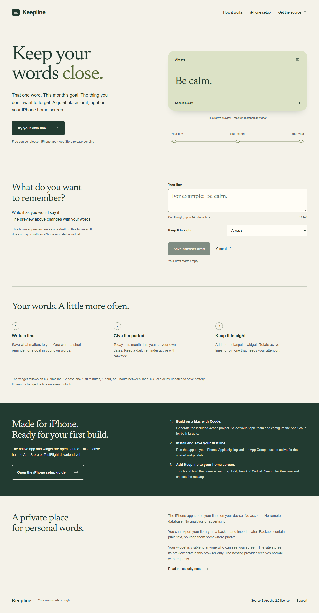
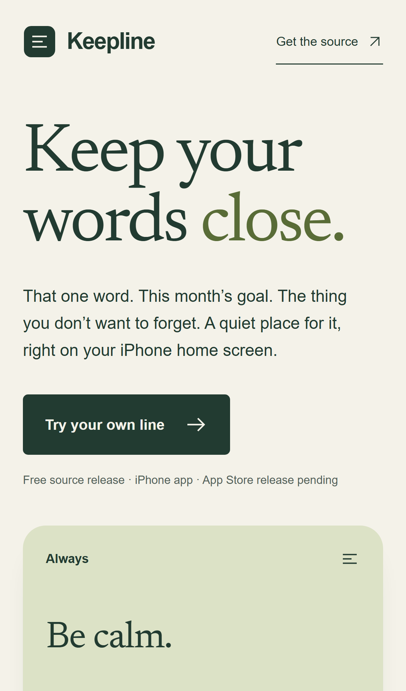
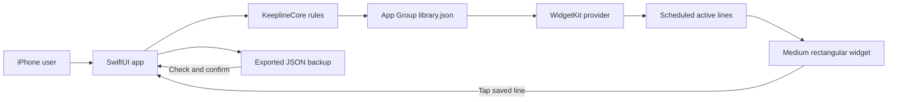
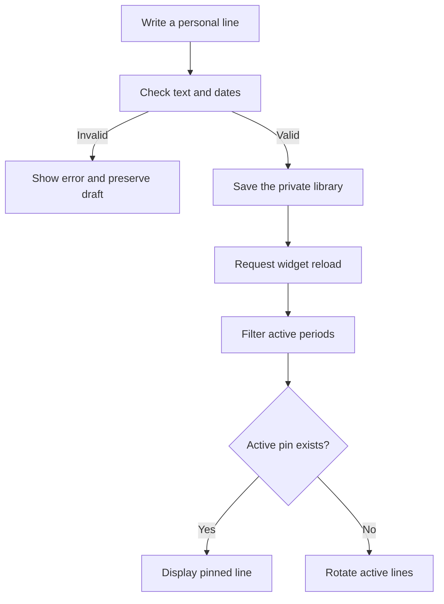

# Keepline

[](https://github.com/kandulanikhilvarma/keepline/actions/workflows/verify.yml)
[](LICENSE)

Your own words, in sight.

Keepline is an iPhone app with a rectangular home-screen widget.
Save a word, a short reminder, or a goal. The widget repeats active lines through an iOS timeline.
You supply every personal line. The app starts with an empty library.

The [public site](https://keepline-weld.vercel.app) explains the app and supplies a browser preview.
The iPhone source release needs Apple signing before device installation.
There is no App Store or TestFlight download yet.
See the [Apple setup guide](docs/APPLE-SETUP.md) and [release evidence](docs/RELEASE.md).

## First release

- Save and edit up to 200 lines. Each line can contain up to 140 characters.
- Choose Today, This month, This year, Always, or Custom dates.
- Pin an active line. Rotate other active lines about every 30, 60, or 180 minutes.
- Archive, restore, and delete lines from the library.
- Tap the widget to open its saved line in the editor.
- Export a backup. Import a checked backup after confirmation.
- Recover from the earlier valid save if the current file cannot be read.

The widget supports the medium rectangular home-screen family only.
A line can wrap inside the rectangle. The app supports iOS 17 and newer on iPhone.

Apple controls widget updates and can delay them to save battery.
The widget cannot change its line on every unlock.
See [Apple's timeline guidance](https://developer.apple.com/documentation/widgetkit/keeping-a-widget-up-to-date).

## Screenshots

The website shows a labeled example until the visitor writes a line.
The browser draft stays separate from the iPhone library.





Native screenshots from the simulator appear in the CI evidence when its run completes.
Native test screenshots use isolated records. The screenshots do not represent customer activity.

## Use the app

1. Build and install Keepline with the [Apple setup guide](docs/APPLE-SETUP.md).
2. Select Save your first line.
3. Enter your own words.
4. Select the period.
5. Save the line.
6. Add the rectangular Keepline widget to the home screen.

Use Always for a line that must remain active every day.
Today ends at local midnight. Month and year goals end with their current calendar period.
Custom dates include the start and end dates.
Expired lines remain in the library. The widget excludes them from new timelines.

To renew an expired goal, open its editor and select Use the current period.
To pin a line, use the editor switch or its Library context menu.
Next line clears the pin and advances the current rotation.

## Local setup

The native app uses SwiftUI and WidgetKit. Native Apple APIs supply home-screen widget support.
The Foundation package keeps date, validation, persistence, and rotation rules independent from the interface.
The static site uses Vite and TypeScript. The site needs no server or environment secrets.

### iPhone app

Use a Mac with Xcode 16 or newer and XcodeGen.

```sh
git clone https://github.com/kandulanikhilvarma/keepline.git
cd keepline
swift test
brew install xcodegen
cd ios
xcodegen generate
open Keepline.xcodeproj
```

Run the Keepline scheme on an iPhone simulator.
For a real iPhone, configure Apple signing and App Groups for both targets.
The default group is `group.studio.kandula.keepline`.
Change identifiers in `ios/project.yml` before you regenerate the project for another owner.

### Website

Use Node.js 22.12 or newer.

```sh
cd site
npm ci
npm run dev
```

Open the URL that Vite prints.
The preview can save one local browser draft. The preview cannot install or synchronize an iPhone widget.

## Configuration

| Setting | Location | Purpose |
| --- | --- | --- |
| Bundle identifiers | `ios/project.yml` | Identify the app and widget for Apple signing. |
| `APP_GROUP_IDENTIFIER` | `ios/project.yml` | Connect the app and widget to the same private container. |
| Rotation interval | App Settings | Select 30, 60, or 180 minutes. |
| Widget pin | Line editor or Library menu | Keep one active line visible. |
| Vercel root | Connected project | Use `site`, build with `npm run build`, serve `dist`. |

The release has no authentication provider, remote database, payment provider, or cloud synchronization.
iOS controls access to the private container. A device passcode protects access to the iPhone.
The app has no separate app lock. The widget intentionally displays personal text on the home screen.

## Architecture



The app is the only writer. The extension reads the shared file and plans timeline entries.
Each save uses an atomic file replacement. The store preserves an earlier valid save before the next replacement.
The widget schedules rotation slots and local midnight boundaries.
An expired or archived line never enters a newly generated timeline.
iOS controls when it accepts a requested timeline reload.



The website has a separate local browser draft. It makes no request with the draft's text.
Vercel serves the static page, scripts, and font files.

## Validation

```sh
swift test
cd site
npm ci
npm run build
npx playwright install chromium
npm test
```

The core tests check Unicode text, dates, leap years, time zones, midnight boundaries, rotation, pins, persistence, and recovery.
The tests also check invalid imports, duplicate identifiers, file limits, and repeated saves.
Browser tests check desktop and mobile workflows, keyboard focus, layout, accessibility, and unavailable storage.
GitHub CI also builds the native app and widget, then runs the app workflow on an iPhone simulator.

Automated accessibility checks cannot replace real VoiceOver and device tests.
Real-device signing, home-screen widget behavior, and Apple acceptance need the owner's Apple setup.
The [release record](docs/RELEASE.md) separates completed checks from activation requirements.

## Deployment and cost

The public repository uses GitHub. The static site uses the connected Vercel project.
Both use free service tiers for this release. No paid domain, backend, or add-on is necessary.
The software has no subscriptions or paid features.

Apple distribution has separate membership and legal requirements.
The owner must approve any paid enrollment and accept Apple's terms personally.
See [deployment notes](docs/DEPLOYMENT.md).

## Contribute and report defects

Read [CONTRIBUTING.md](CONTRIBUTING.md) before a change.
Use [SECURITY.md](SECURITY.md) for a private security report.
Report ordinary defects through GitHub issues.

Later work can add separate widget configurations, optional iCloud sync, and translations.
The first release does not generate advice or connect to financial services.

## License

Apache-2.0. Copyright 2026 Nikhilvarma Kandula.
The included Newsreader font uses SIL OFL 1.1. See [NOTICE](NOTICE) and its [font license](site/public/fonts/OFL.txt).

[LinkedIn](https://www.linkedin.com/in/nikhilvarmakandula) · [Email](mailto:kandulanikhilvarma@gmail.com) · [Portfolio](https://kandula.studio)
